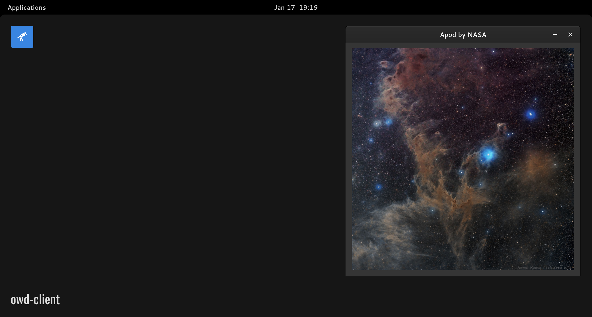

# APOD module for OWD Client
> Display the Astronomy Picture of the Day by NASA in an Open Web Desktop window

<p>
    
</p>

<p>
    <a href="https://github.com/MatiTea/owd-app-apod/blob/main/LICENSE"></a>
    <a href="https://github.com/owdproject/owd-client"></a>
    <a href="https://github.com/topics/owd-modules"></a>
</p>

## Overview
<p>
    Discover astronomy curiosities with NASA in your Open Web Desktop client.
</p>
<p>
    Information is retrieved from the open API using the example query<br />
    https://api.nasa.gov/planetary/apod?api_key=DEMO_KEY
</p>

## Quick install
- Move to your client folder, then
  ```
  # Enter modules app directory
  cd src/modules/app/
  
  # Clone this repository
  git clone https://github.com/MatiTea/owd-app-apod
  ```
- Define this module in `owd-client/client.extensions.ts`
  ```js
  import AboutModule from "@owd-client/core/src/modules/app/about";
  import DebugModule from "@owd-client/core/src/modules/app/debug";
  import ApodModule from "owd-app-apod/client";

  export default {
    app: {
      modules: [
        AboutModule,
        DebugModule,
        ApodModule,
      ]
    },
    ...
  ```

## Compatibility
- Open Web Desktop client v2.0.0-beta.3

## License
This project is released under the [MIT License](LICENSE)